# makina — Architecture

## Design Philosophy

makina is a security scanner that continuously self-learns from human verification.
The model updates on **every Verify Submit** — not at fixed thresholds.
Label count is a maturity indicator, not a capability gate.

### Code organisation: Hexagonal + Vertical Slice

The Rust core is laid out as **vertical slices over a hexagonal core**:

- **Vertical slice (`features/`)** — one module per user-visible feature
  (Scan, Verify, Knowledge, Model, plus the supporting `labels` and
  `findings` endpoints). Each slice owns its handler and stays free of
  unrelated concerns; new features land as new directories rather than
  edits to a god `handlers.rs`.
- **Hexagonal boundary (`infra/`)** — every byte of `reqwest` traffic to
  the Python ML service goes through `MlClient`. Feature handlers see
  domain types (`Finding`, `Language`) and never serialise wire
  formats themselves; this is the seam tests will swap.
- **Data layer (`store/`)** — SQLite reads/writes for the three
  databases. Functions are imported by handlers via `crate::store::*`.
- **Shared API contract (`api/`)** — `Router::new()` composition and
  request/response DTOs. No business logic.

The Python ML service follows the same shape on a smaller scale: thin
FastAPI handlers in `server.py` delegate to `services/` modules
(currently `training.py` for the GBDT pipeline) so the wire format stays
separate from the ML code path. The `analyzer.py`, `embedder.py`,
`taint_engine.py`, etc. modules are the domain core that services compose.

The frontend follows MVVM-ish separation: `lib/api.ts` is the network
boundary, `lib/types.ts` the shared contract, `lib/components/` the
view layer, and `+page.svelte` the page-level state coordinator.

## System Components

```
┌─────────────────────────────────────────────────────┐
│  Browser (SvelteKit)                                │
│  Scan tab → Verify tab → Knowledge tab              │
└────────────────────┬────────────────────────────────┘
                     │ HTTP
┌────────────────────▼────────────────────────────────┐
│  Rust core  (axum)            :7373                 │
│  - /api/scan                                        │
│  - /api/feedback                                    │
│  - /api/verify/queue  (GET / POST / DELETE)         │
│  - /api/knowledge     (GET / POST[?skip_train])     │
│  - /api/retrain       (POST — proxy to ML /train)   │
│  - /api/stats                                       │
│  SQLite  ~/.makina/feedback.db  (ML training data)    │
│  SQLite  ~/.makina/verify.db    (pending queue)       │
│  SQLite  ~/.makina/knowledge.db (verified cases)      │
└──────────┬──────────────────────────────────────────┘
           │ HTTP (internal)
┌──────────▼──────────────────────────────────────────┐
│  Python ML service            :8080                 │
│  - /semgrep   rule-based scan (semgrep + taint)     │
│  - /analyze   CodeBERT semantic similarity          │
│  - /taint     interprocedural taint flow            │
│  - /embed_with_graph  call-graph-augmented embeds   │
│  - /train         GBDT retrain on all labels        │
│  - /predict       GBDT confidence (768-dim embed)   │
│  - /predict_batch GBDT confidence, N embeddings     │
└─────────────────────────────────────────────────────┘
```

### Public deployment topology

Local dev runs everything via `docker compose`. The public site at
`makina.sh` is built differently — see [`DEPLOY.md`](DEPLOY.md) for the
full pipeline. The shape:

```mermaid
flowchart LR
    user([Browser])

    subgraph CF["Cloudflare (free)"]
        cfDNS[DNS<br/>makina.sh / api.makina.sh]
        pages[Pages<br/>SvelteKit static]
        worker[Worker<br/>makina-api-proxy<br/>Host rewrite]
    end

    subgraph GH["GitHub"]
        repo[(s-zaizen/makina)]
        actions[Actions workflow<br/>deploy.yml]
        oidc[OIDC token]
    end

    subgraph GCP["GCP project: makina-prod"]
        wif[Workload Identity<br/>Federation pool]
        sa[makina-deployer<br/>service account]
        ar[(Artifact Registry<br/>asia-northeast1)]
        run[Cloud Run service<br/>makina-api<br/>1 vCPU / 2 GiB / min=1]
        subgraph runC[Container]
            rust[Rust API<br/>:&#36;PORT public]
            ml[Python ML<br/>127.0.0.1:8081 loopback]
        end
    end

    user -->|makina.sh| pages
    user -->|api.makina.sh| worker
    worker -->|fetch with Host: *.run.app| run
    rust <-->|loopback HTTP| ml

    repo --> actions
    actions -- assertion.repository --> oidc
    oidc -- exchange --> wif
    wif -- impersonate --> sa
    actions -- docker push --> ar
    sa -- gcloud run deploy --> run
    ar -.image pull.-> run

    classDef cf fill:#f4811f20,stroke:#f4811f
    classDef gcp fill:#4285f420,stroke:#4285f4
    classDef gh fill:#33333320,stroke:#333
    class CF,cfDNS,pages,worker cf
    class GCP,wif,sa,ar,run,runC,rust,ml gcp
    class GH,repo,actions,oidc gh
```



The `cloudrun` Dockerfile stage co-locates the Rust API and Python ML
in one container so cold-start happens once, internal traffic stays on
loopback, and only the Rust port is exposed. Cloud Run instances are
ephemeral — there is no persistent volume, so `feedback.db` /
`knowledge.db` / `model.json` reset on every revision. Public mode
(the default for this deployment) disables every learning-loop write
endpoint, so the lack of persistence is by design: the model ships as
a frozen artefact baked into the image.

## Scan Pipeline

For each scan request, three detectors run in parallel and are merged:

1. **semgrep** — community rules + custom taint rules (YAML)
2. **CodeBERT semantic** — see *"ML analysis gate"* below
3. **taint engine** — tree-sitter BFS from sources to sinks, cross-function

After merge, each finding is embedded with call-graph-augmented context
(enclosing function + 1-hop callees) and stored in SQLite. The Rust core
then calls `POST /predict_batch` with every finding's embedding to get a
GBDT probability, and blends:

```
finding.confidence = 0.5 × heuristic_score + 0.5 × gbdt_probability
```

If the GBDT model isn't trained yet (`model.json` absent), the heuristic
score is kept unchanged. This is how the accumulated labels actually
influence scan output.

### ML analysis gate (hybrid, GBDT-first)

`/analyze` uses a hybrid gate so CodeBERT's noisy similarity alone cannot
flood a scan with false positives. For each sliding window:

1. **Sink regex (primary)** — the window is emitted immediately if any
   per-CWE sink regex (`eval`, `system`, `pickle.loads`,
   `r_core_call_str_at`, `Runtime.getRuntime().exec`, …) matches inside
   it. Sinks are ground truth for this detector; the GBDT is *not*
   consulted.
2. **Similarity + GBDT (secondary)** — otherwise the window must satisfy
   BOTH of:
   - CWE prototype cosine similarity ≥ `CWE_CLASSIFY_THRESHOLD` (0.95)
   - GBDT probability ≥ `GBDT_GATE_THRESHOLD` (0.70)
3. **GBDT absent** — when `model.json` does not exist yet, the analyzer
   falls back to pure similarity with the old 0.80 threshold.

Empirically this cut gson's false-positive count from ~600 to ~7 while
keeping recall on the radare2 `r_core_call_str_at` case-study. The
`gate`, `refined_by`, and `mode` fields on each finding record which
path was taken.

### Refining the `ML` source to exact lines

The CodeBERT analyzer uses a 20-line sliding window for detection, then
narrows each window match to a tight range via (in order of preference):

1. **Sink regex** — per-CWE regex of known dangerous calls (`eval`,
   `system`, `pickle.loads`, `r_core_call_str_at`, …). If a sink matches
   inside the window, the finding is pinned to that line ± 2.
2. **Embedding peak** — otherwise, re-score each line within the window
   against the matched CWE patterns and center the range on the highest-
   similarity line.
3. **Window fallback** — used only when neither signal is available.

The `refined_by` field on each finding records which path was taken.

## Learning Loop

```
Scan → findings stored with CodeBERT embedding vectors
  ↓
Human reviews in Verify tab (TP / FP labels)
  ↓
Verify Submit → POST /api/knowledge {case_no, labels}
  ↓
Rust core: saves labels to feedback.db, moves case to knowledge.db
  ↓
Rust core calls POST /train (fire-and-forget)
  ↓
ML service retrains GBDT on ALL accumulated (embedding, label) pairs
  ↓
New model.json written to ~/.makina/model.json
  ↓
Next scan uses updated GBDT confidence scores
```

The GBDT is retrained from scratch on the full dataset after every Submit.
This is intentional: with small datasets full retraining is cheap (<1s)
and avoids incremental drift. After each retrain the analyzer's in-memory
pattern index is invalidated (`analyzer.reset_index()`) so the next scan
picks up any newly added CWE categories.

### Why the labeled index is not the primary matcher

`analyzer.py` also knows how to build a kNN index of TP embeddings grouped
by CWE from `feedback.db` (`_build_labeled_index`). It is intentionally
**not** used as the primary pattern matcher today, because CVEfixes stores
*whole-method* embeddings — any C function ends up sim≈0.99 against every
other C function, collapsing CWE discrimination. The labeled corpus earns
its keep through the GBDT (method-level TP/FP decision), not through
max-similarity matching. Line-level labeled embeddings would make the
kNN path viable; that is a future direction.

### Bulk import path

`ml/scripts/bulk_import.py` seeds the model from CVEfixes-derived
samples. The dataset itself is **not vendored** — it lives under
`third_party/datasets/cvefixes/` with a `fetch.sh` that pulls from
Zenodo, a `README.md` with license + citation, and a `.gitignore` that
excludes the downloaded artefacts. CVEfixes is CC BY 4.0 (Bhandari,
Naseer, Moonen, 2021); see `third_party/datasets/README.md` for
attribution policy.

`ml/scripts/converters/cvefixes.py` walks `method_change` and emits
**two records per CVE pair** keyed by `(name, signature, file_change_id)`:

- a TP record from the vulnerable side (`before_change='True'`) — full
  method body + the diff's deleted-line spans projected onto
  method-relative coordinates;
- an FP record from the patched side (`before_change='False'`) — full
  patched method body + the diff's added-line spans on the patched
  method's coordinates.

Each record carries `{code, language, label:"tp"|"fp", ranges, cve_id,
cwe, severity, filename}`. The patched method is used for FP rather
than random clean code because re-using `code_before` as both classes
would collapse the supervision signal and overfit the model to context
lines that did not change. Pairing each vulnerable method with its own
patched counterpart gives the GBDT a hard, semantically-meaningful
counterexample for every CVE.

Quality filters applied during conversion:

- **filename filter** — files matching `/test*/`, `_test.`, `/docs/`,
  `CHANGELOG`, `*.md`, etc. are dropped. Tests touched by a CVE-fix
  commit are not vulnerabilities; they only verify the fix.
- **commit-message filter** — the conversion JOINs `commits.msg` and
  drops pairs whose commit subject lacks any security keyword (`vuln`,
  `cve`, `overflow`, `inject`, `escape`, `bypass`, `auth`, `leak`, …)
  or is dominated by refactor/rename/cleanup/typo/merge/version-bump
  language. CVEfixes labels every method touched in the security
  commit, including incidental cleanup; without this the corpus is
  full of label noise from sweeping commits.
- **`--window N`** — instead of the whole method, slice the code down
  to `(changed lines ± N)`. Tightens the embedding's focus so it
  isn't dominated by shared context lines that don't differ between
  the TP and FP sides.
- **`--drop-noise`** — skip diff lines that carry no security signal:
  blank, comment-only, brace-only, trivial constant initialisations
  (`x = 0;`, `unsigned int n = 0;`), and pure control flow (`return
  res;`, `goto out;`, `break;`). Returns that contain a function call
  (`return execute(req);`) are kept — the call may be the sink site.
- **`--max-ranges N`** — drop the entire CVE pair if either side has
  more than N disjoint hunks (default 3). Sweeping commits with many
  scattered edits are almost always refactors masquerading as
  security fixes and produce noisy labels.
- **`--cross-cve-fp-ratio R`** — additionally pair each TP with a
  random patched method from a *different* CVE so the model learns
  "looks like a fix from anywhere = not vulnerable" rather than just
  "looks like the paired fix".

`bulk_import.py` plays each record back as a Verify Submit:

1. For every range, `POST /api/findings/manual` with the full method as
   `code` and the range as `(line_start, line_end)`. The backend embeds
   the snippet via `/embed_with_graph` so the resulting feature vector
   sees the same call-graph context the live scanner would use. The
   request also carries `group_key=<cve_id>` which the backend stores
   on the finding row.
2. `POST /api/verify/queue` bundles all findings under one case keyed
   by the CVE id.
3. `POST /api/knowledge?skip_train=true` archives the case with every
   finding labelled by the record's `label` (`tp` or `fp`) — without
   firing the per-submit retrain.

After the batch, a single `POST /api/retrain` brings the GBDT up to
date. This avoids a retrain stampede and keeps the training
distribution aligned with what the model sees at inference (per-finding
embeddings rather than whole-method labels).

The trainer reads `group_key` and uses sklearn's `GroupShuffleSplit`
when at least two distinct groups are present, so a paired TP/FP twin
never straddles the 80/20 train/val boundary — random `train_test_split`
would leak the answer into validation when the same CVE's vulnerable
and patched methods land on opposite sides. Live-scan rows have no
group key and fall back to the previous stratified split.

A secondary retrain fires every 10 individual feedback labels as a
supplementary signal path.

### Offline trainer (prod model bake)

`ml/scripts/train_offline.py` mirrors the Verify-Submit codepath but
skips the HTTP API and SQLite entirely:

```
samples.jsonl → flatten ranges → call-graph snippets
              → embedder.embed_batch (batch=32)
              → services.training.train_from_arrays
              → model.json + metrics.json
```

The route-driven `train(db_path, ...)` is now a thin wrapper that
reads embeddings from `feedback.db` and delegates to
`train_from_arrays(embeddings, labels, groups, ...)` — both paths
produce byte-compatible model artefacts.

End-to-end on the v1.0.8 corpus (~14 k samples / ~19 k findings):

| Path                              | Time on CPU | Time on GPU |
|-----------------------------------|-------------|-------------|
| `bulk_import.py` (HTTP per finding) | 5–15 hours  | n/a         |
| `train_offline.py` (in-process, batched) | 25–35 min  | 5–10 min    |

The HTTP-less path is what bakes the production model: train locally,
upload `model.json` to `gs://makina-prod-models/`, and Cloud Run's
entrypoint pulls it on container boot (see `CONTRIBUTING.md` →
*Shipping a Frozen Model to Production*). Public deployments never
expose `/train`, so this is the only way the prod model gets refreshed.

## Logging

Both services emit **structured JSON to stdout** (picked up by `docker compose logs`).

- **Rust** — `tracing` + `tracing-subscriber` (JSON). A middleware reads or
  generates `x-request-id` per request, attaches it to a span, echoes it
  back in the response header, and logs method / path / status / elapsed_ms.
- **Python ML** — stdlib `logging` + `python-json-logger`. A FastAPI
  middleware binds `x-request-id` to a `contextvars` context; a filter
  injects it into every log record.
- **Propagation** — every Rust → ML HTTP call forwards `x-request-id`, so
  logs across the two services can be joined on `request_id`.

Log level is controlled by `RUST_LOG` (Rust) and `MAKINA_LOG_LEVEL` (Python),
both defaulting to `info`.

## Model Maturity Stages

Stages are **descriptive** — the model is always active and learning.

| Stage         | Labels | Description                                    |
|---------------|--------|------------------------------------------------|
| bootstrapping | 0      | Rules + CodeBERT only; no GBDT yet             |
| learning      | 1–49   | GBDT training begins; limited signal           |
| refining      | 50–499 | GBDT improving; confidence scores meaningful   |
| mature        | 500+   | Well-trained; high-confidence predictions      |

## Data Model

Three SQLite databases under `~/.makina/`:

```sql
-- feedback.db: ML training data (read by Python ML service)
-- findings: one row per detected finding
id TEXT PRIMARY KEY        -- UUID
code_hash TEXT             -- SHA-256 of scanned code
feature_vector BLOB        -- CodeBERT embedding (768 × float32, 3072 bytes)
rule_id TEXT               -- semgrep rule or CWE identifier
language TEXT
line_number INTEGER
confidence REAL
label TEXT                 -- 'tp' | 'fp' (NULL until verified)
labeled_at TEXT            -- ISO-8601
created_at TEXT

-- verify.db: pending human review queue
-- verify_queue: cases awaiting labeling
case_no INTEGER PRIMARY KEY AUTOINCREMENT
cve_id TEXT                -- optional CVE identifier
code TEXT
language TEXT
findings_json TEXT         -- JSON array of Finding objects
submitted_at TEXT

-- knowledge.db: verified cases with labels
-- knowledge: cases that have been labeled and submitted
case_no INTEGER PRIMARY KEY
cve_id TEXT
code TEXT
language TEXT
findings_json TEXT         -- JSON array of Finding objects
labels_json TEXT           -- JSON map of {finding_id: "tp"|"fp"}
submitted_at TEXT
verified_at TEXT
```

## Directory Layout

```
makina/
├── crates/makina/           Rust core (axum API, SQLite, scan orchestration)
│   └── src/                 — hexagonal + vertical-slice layout
│       ├── api/             router composition + shared API DTOs
│       │   ├── mod.rs       Router::new() wiring features::* into routes
│       │   └── models.rs    request/response types (Finding, Scan*, …)
│       ├── features/        one module per user-visible feature
│       │   ├── scan/        POST /api/scan — semgrep + analyze + taint
│       │   ├── labels/      POST /api/feedback — TP/FP toggle on a finding
│       │   ├── findings/    POST /api/findings/manual — bulk_import seed
│       │   ├── verify/      GET/POST/DELETE /api/verify/queue
│       │   ├── knowledge/   GET/POST /api/knowledge
│       │   └── model/       /api/stats, /api/retrain, /api/model_metrics
│       ├── infra/           outbound adapters
│       │   └── ml.rs        MlClient — single seam for ML HTTP traffic
│       ├── store/           SQLite data layer (feedback/verify/knowledge.db)
│       └── logging.rs       tracing JSON init + request_id middleware
├── ml/                    Python ML service (FastAPI)
│   ├── scripts/           bulk_import.py (dataset → knowledge, no scan)
│   │   ├── converters/    cvefixes.py (method pairs → samples.jsonl)
│   │   │                  cvefixes_pairs.py (diff hunks → samples_pairs.jsonl)
│   │   └── run_ablations.py  pair-feature ablation harness (research)
│   └── makina_ml/
│       ├── server.py      thin FastAPI route handlers
│       ├── services/
│       │   └── training.py GBDT pipeline (load → split → fit → eval → persist)
│       ├── analyzer.py    CodeBERT semantic analysis
│       ├── embedder.py    CodeBERT embedding (lazy-loaded)
│       ├── taint_engine.py interprocedural taint via tree-sitter
│       ├── call_graph.py  call graph extraction (AST + regex fallback)
│       ├── features.py    50-element hand-crafted feature vector
│       ├── logging_config.py  JSON logging + request_id contextvar
│       └── semgrep_scanner.py  semgrep wrapper + language detection
├── frontend/              SvelteKit UI (Svelte 5 Runes, adapter-node)
│   └── src/
│       ├── routes/        +page.svelte (main layout + state), +layout.ts
│       └── lib/
│           ├── components/ CodeEditor, FileTree, FindingCard, VerifyTab, KnowledgeTab …
│           ├── highlighter.ts  shiki singleton (vitesse-dark theme)
│           ├── api.ts     fetch wrappers (PUBLIC_API_URL)
│           ├── types.ts   shared TypeScript types
│           ├── folder.ts  folder drag-and-drop utilities
│           └── placeholders.ts  per-language sample snippets for the Scan tab
├── third_party/           External assets (not vendored)
│   └── datasets/          Training datasets (fetched via per-dir fetch.sh)
│       └── cvefixes/      CVEfixes — CC BY 4.0, see README.md
├── .claude/               Claude Code configuration
│   ├── commands/          vuln-add, vuln-verify, vuln-add-verify-with-claude
│   ├── hooks/typecheck.sh   PostToolUse: lint after Write/Edit
│   ├── hooks/pre-push       git pre-push hook: clippy + test + ruff + npm check
│   ├── hooks/prepush-gate.sh PreToolUse (Bash): intercepts git push for Claude
│   ├── rules/               Path-scoped rules (backend.md, ml.md, frontend.md)
│   └── settings.json        Hook bindings (PreToolUse + PostToolUse)
├── CLAUDE.md              AI assistant instructions for this repo
├── CONTRIBUTING.md        Commit conventions, dev setup, code style
└── docs/ARCHITECTURE.md   this file
```
